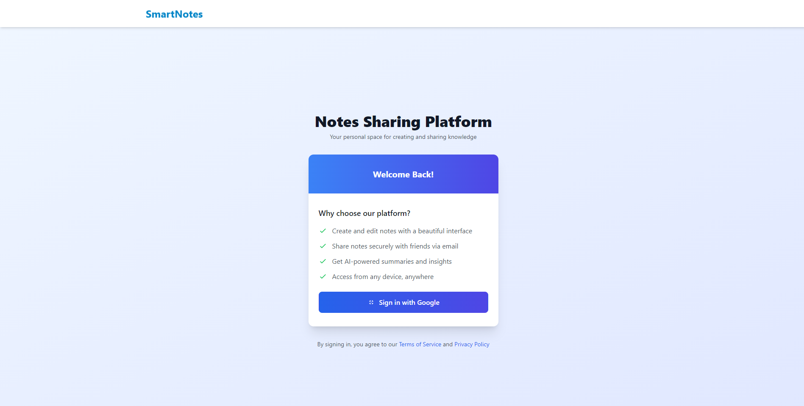
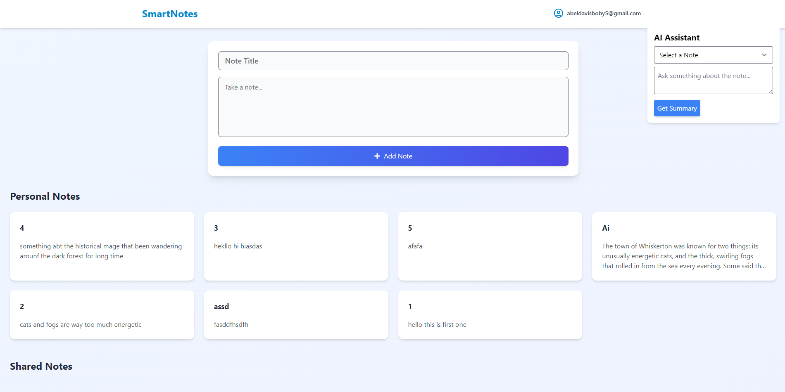
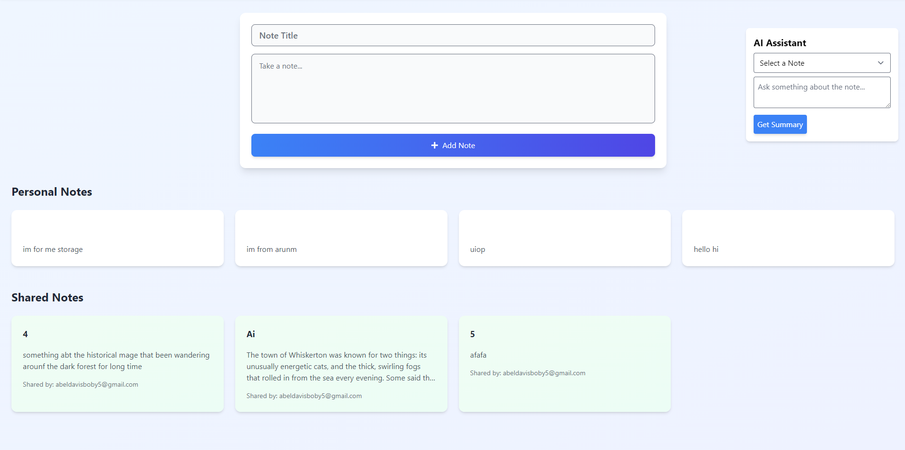
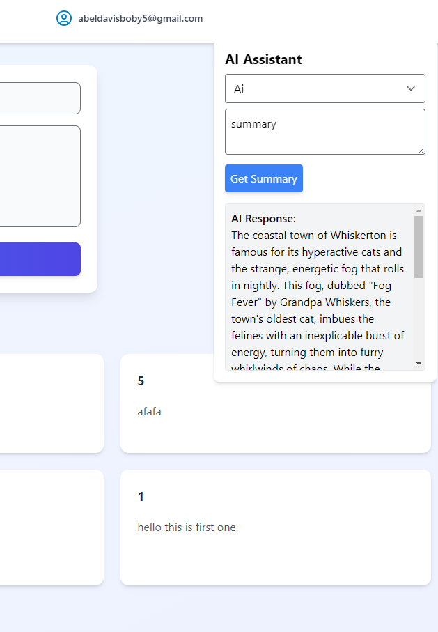
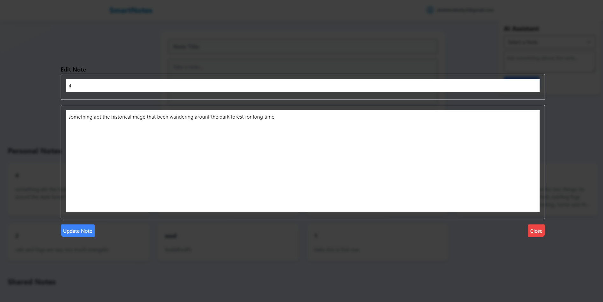
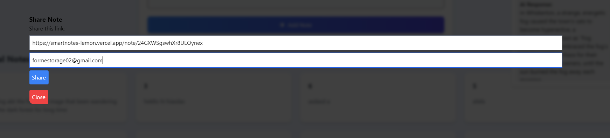

# Notes Sharing Platform with AI Assistant ✨  

An innovative web-based platform to create, edit, and share notes effortlessly, featuring Google Authentication, AI-powered assistance, and real-time synchronization.  

---

## 🚀 Features  

### 📝 **Core Functionalities**  
- **Create and Edit Notes**: Effortlessly create and manage your personal notes with a title and detailed content.  
- **Share Notes**: Share your notes securely with friends via email, allowing them to view shared notes in their "Shared Notes" section.  

### 🤖 **AI Assistant**  
- **Summarize Notes**: Generate AI-powered summaries of your notes with the click of a button.  
- **Interactive Q&A**: Ask questions about your notes and receive AI-generated answers, making your notes smarter and more useful.  

### 🔒 **Google Authentication**  
- Securely log in using Google Sign-In and access your notes across multiple devices.  

### ⚡ **Real-Time Updates**  
- Instant synchronization of notes and changes, powered by Firebase Firestore.  

### 📱 **Responsive Design**  
- Fully responsive design, ensuring a seamless user experience across devices.  

---

## 🎨 Components  

### **Login Page**  
- Informative landing page describing the app's features and purpose.  
- Google Sign-In button for secure authentication.  

### **Notes Page**  
- Create new notes with titles and content.  
- Edit existing notes in a modal with organized and user-friendly design.  
- Delete notes directly from the notes list.  
- Share notes via email to friends.  

### **Shared Notes Section**  
- View all notes shared with you.  
- A modal to view shared notes with a clean, read-only interface.  
- Option to delete shared notes from your list.  

### **AI Assistant**  
- Located on the right side of the screen for easy access.  
- Dropdown menu to select a note for analysis.  
- Prompt box for user queries about the selected note.  
- AI-generated responses and summaries powered by the Gemini API.  

### **Header with Logout**  
- Logout button at the top right corner, enabling users to securely sign out.  

---

## 💻 Technology Stack  

### Front-End:  
- **React**: Framework for building the user interface.  
- **Tailwind CSS**: Utility-first CSS for modern and responsive styling.  

### Back-End/Database:  
- **Firebase Firestore**: Real-time cloud database for storing notes and shared notes.  
- **Firebase Authentication**: Google Sign-In integration for secure login.  

### AI Integration:  
- **Gemini API**: AI-powered API for generating summaries and answering questions about notes.  

---

## 📸 Screenshots  

| Login Page                              | Notes Page                              | Shared Notes Section                              |  
|-----------------------------------------|-----------------------------------------|--------------------------------------------------|  
|   |   |   |  

| AI Assistant                            | Edit Notes                              | Share Note Modal                                |  
|-----------------------------------------|-----------------------------------------|------------------------------------------------|  
|    |    |     |  

---

## 📂 Project Structure  

```
src/  
├── components/  
│   ├── Login.js  
│   ├── Notes.js  
│   ├── AiAssistant.js  
│   ├── Header.js  
│   ├── NoteDetail.js  
├── firebase.js  
├── App.js  
├── index.js  
```

---

## 🌟 How to Run  

1. Clone this repository:  
   ```bash  
   git clone https://github.com/Abelboby/Smart-Notes.git
   ```  

2. Navigate to the project directory:  
   ```bash  
   cd Smart-Notes  
   ```  

3. Install dependencies:  
   ```bash  
   npm install  
   ```  

4. Add your Firebase configuration in `firebase.js`.  

5. Start the development server:  
   ```bash  
   npm start  
   ```  

6. Open the app in your browser:  
   ```
   http://localhost:3000  
   ```  

---

## 🛠 Future Enhancements  

- Add real-time collaborative editing for shared notes.  
- Enable rich text formatting for notes.  
- Provide personalized user settings for themes and layouts.  
- Expand AI Assistant capabilities for advanced queries.  

---

## 📜 License  

This project is licensed under the MIT License - see the [LICENSE](./LICENSE) file for details.  

---

## 🌟 Contributions  

We welcome contributions! Feel free to fork this repository, open a pull request, or submit issues to help improve this project.  

---

## 💌 Acknowledgments  

- **Firebase**: For real-time database and authentication.  
- **Gemini API**: For powering the AI Assistant.  
- **React & Tailwind CSS**: For providing the tools to build this application.  

---

## 📧 Contact  

For any inquiries or feedback, feel free to contact me at:  
**Email**: abeldavisboby@example.com  
**GitHub**: [Abelboby](https://github.com/Abelboby)  